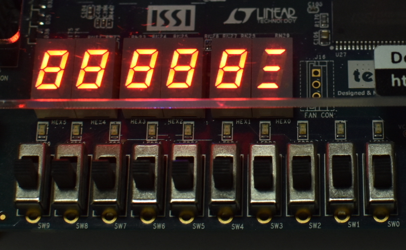

# Virtual DE1-SoC Blinkenlichten

## Contents

* [Introduction](#introduction)
* [What's in the box?](#whats-in-the-box)
* [Setting up the simulation](#setting-up-the-simulation)
* [Simulating RTL](#simulating-rtl)
* [Simulation versus The Real Thing™](#simulation-versus-the-real-thing)
* [Simulating the post\-synthesis netlist](#simulating-the-post-synthesis-netlist)

## Introduction

Some of the courses we teach rely on students using a DE1-SoC FPGA board. Unfortunately, at the time of writing, many students are off campus and unable to access their boards.

This repository contains a simple GUI that connects to the simulated RTL and allows students to interact with “virtual” switches, LEDs, etc.

It has been tested with the ModelSim 10.5b version that ships with Quartus 19.1.0 Lite Edition.

## What's in the box?

The virtual DE1-SoC consists of two parts:

- a Tcl file (`de1_gui.tcl`) to be loaded in ModelSim before simulation to implement the GUI, and
- a SystemVerilog file (`de1_gui.sv`) to be instantiated in the testbench to connect the DUT to the GUI.

The `example` folder also contains a simple demo design, used below to describe setup and operation.

## Setting up the simulation

Launch ModelSim and create a project; add `button_pusher.sv`, `de1_gui.sv`, and `tb_de1_gui.sv` to the project. Compile the entire design as usual, and load the compiled `tb_de1_gui` design.

Next, load the `de1_gui.tcl` via _File&rarr;Load&rarr;Macro&nbsp;File..._ or by issuing the `source de1_gui.tcl` command. You should see a new window that shows the switches, buttons, LEDs, and 7-segment displays of the DE1-SoC board:

All switches and buttons are in the “off” position (i.e., the SW signals are all 0, and the KEY signals are all 1 as they are active-low). The LEDs are simulating the dimly-lit state they appear in when they are not driven on the real board.

The fast-forward button  does the same thing as  in ModelSim — it advances the simulation by the amount of time shown next to  — but saves you the need to constantly switch window focus between the DE1-SoC GUI and ModelSim.

Move the switches and push the buttons to see what you can interact with. Note that unlike on the physical board, buttons stay pushed if you click on them to let you gradually advance the simulation without holding the mouse button; clicking the buttons again will release them. Because the hardware design is not being simulated yet, none of the LEDs or 7-segment displays will change state.

## Simulating RTL

Now it's time to combine the GUI with simulated hardware. Add the testbench signals to a waveform and simulate for 100ps.

Next, reset the design. The `button_pusher` design uses `KEY0` as reset, so click `KEY0` to push it in, advance the simulation for 100ps, click `KEY0` again to release it, and advance for another 100ps:

You should see that the virtual board display has changed:

Try out the various switches and buttons and watch the design react. Remember that you have to **manually advance the simulation** — otherwise the simulated hardware will not react to GUI inputs.

## Simulation versus The Real Thing™

If you have a physical DE1-SoC, synthesize `button_pusher` (don't forget the pin assignment file!) and download it to the FPGA. You will see that the initial state of the simulation differs from the real board, which will in all likelihood have the seven-segment displays lit:

Once you reset the design using `KEY0`, the two should behave correspondingly.

Why is this happening? In the RTL simulation, several signals — in particular the `HEX0`...`HEX5` registers that drive the 7-segment display drivers — are _undefined_ (`'x`), and acquire logical 0 or 1 values only after reset. But in the real hardware, there is no such thing as undefined, so in the real hardware those registers will have some kind of logical value; most likely this is 0, which causes the 7-segment displays to light up (as they are active-low). While you cannot rely on this initialization in general, it explains the discrepancy between the simulation and the hardware.

## Simulating the post-synthesis netlist

Now synthesize `button_pusher` using Quartus and locate the `button_pusher.vo` file in the `simulation/modelsim` folder.

Create a new ModelSim project as described above, except that instead of the `button_pusher.sv` RTL file add the `button_pusher.vo` file you synthesized, and compile the design.

When you now start simulation, you will need to add both the `cyclonev_ver` and `altera_ver` libraries:

(For more complex designs, you might have to add other libraries, such as `altera_mf_ver`, `altera_lnsim_ver`, etc.)

After adding these libraries, select `work.tb_de1_gui` from the _Design_ tab and load the simulation.

Now after you advance the simulation for the first 100ps, you will see that it corresponds to the real DE1-SoC even before you reset the design:

This is because you are now simulating the gate-level netlist generated by Quartus, and the libraries you included (which define the primitive FPGA components) are initialized like the FPGA.
